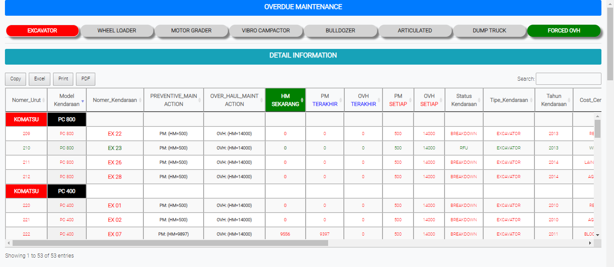

# Maint / OVH

### OVERDRUE MAINTENANCE

Tabel ini untuk menginformasikan kondisi kondisi kendaraan alat berat di setiap tipe kendaraan dalam melakukan pengoprasikan

### FORCED OVH

Form ini digunakan memeriksa perbaikan kendaraan alat berat.

* Kendaraan : Cari nama kendaraan di list yang di sediakan&#x20;
* Workshop : Cari nama workshop di list yang di sediakan&#x20;
* Pilih Parts : Masukan sparepart yang cari di list yang disediakan
* Jika sudah memasukan data di form  klik aktivitas
