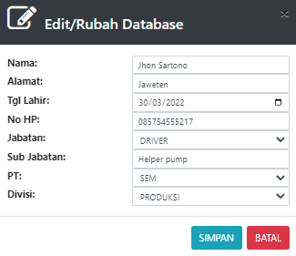

# TAMBAH Foreman Operator/Driver\&Fuelman

### DATABASE DRIVER/OPERATOR, FUELMAN & PENGAWAS

Tabel ini menginformasikan list supir, operator, fuelman, dan pengawas yang terdaftar. List ini digunakan unutk pengupahan supir/operator

Tabel ini bisa menambah, mengedit dan menghapus data supir&#x20;

### TAMBAH SUPIR FOREMAN

Form ini digunkana untuk menambahkan supir  dan foreman untuk kendaraan rimau

* Nama : Masukan nama supir tersebut&#x20;
* Alamat : Alamat rumah supir
* tgl lahir : tanggal lahir supir&#x20;
* No HP : Nomer handphone supir
* Jabatan : Jabatan yang diberikan pada user baru (DRIVER, PENGAWAS, DAN FUELMAN)
* Sub Jabatan : Subjabatan
* PT : Tempat perusahaan supir tersebut (Masukan dengan list yang disediakan)
* Divisi : divisi perusahaan (Masukan dengan list yang disediakan)
* Jika sudah terisi semua klik tambah&#x20;

### EDIT/RUBAH DATABASE

Form ini digunakan untuk merubah atau mengedit jika data supir memiliki kesalahan&#x20;

* Nama : Masukan nama supir tersebut&#x20;
* Alamat : Alamat rumah supir
* tgl lahir : tanggal lahir supir&#x20;
* No HP : Nomer handphone supir
* Jabatan : Jabatan yang diberikan pada user baru (DRIVER, PENGAWAS, DAN FUELMAN)
* Sub Jabatan : Subjabatan
* PT : Tempat perusahaan supir tersebut (Masukan dengan list yang disediakan)
* Divisi : divisi perusahaan (Masukan dengan list yang disediakan)
*   Jika sudah terisi semua klik tambah

    ###
