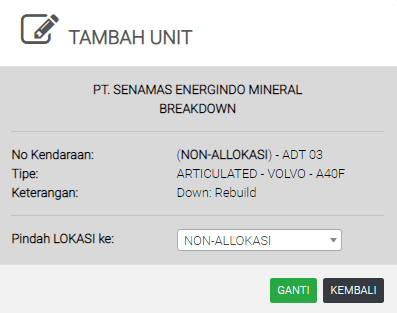

# Pindah Kendaraan

### PINDAH KENDARAAN ATAU SET HM/KM

Tabel ini menginformasikan status kendaraan hauling. Tabel ini bisa menambahkan, atau memindahkan kendaraan kelokasi yang dibutuhkan.

### TAMBAH UNIT

Cari nomer kendaraan yang ada di laporan ini, KLIK nomer kendaraan dan pilih lokasi pemindahan nya. Untuk user tertentu, module ini dapat digunakan untuk merubah HM/KM terakhir kendaraan melakukan PM dan OVH
