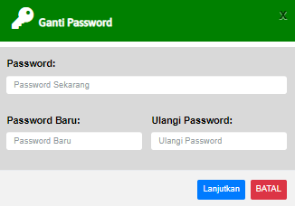

# Ganti Password

### GANTI PASSWORD

Form ini digunakan untuk mengganti atau mengubah password user&#x20;

* Password : Masukan password yang digunakan
* Password Baru : Masukan password baru yang ingin digunakan
* Ulangi Password : Ulangi password baru yang ingin digunakan
* ketika sudah memasukan password baru. Klik lanjutkan&#x20;
